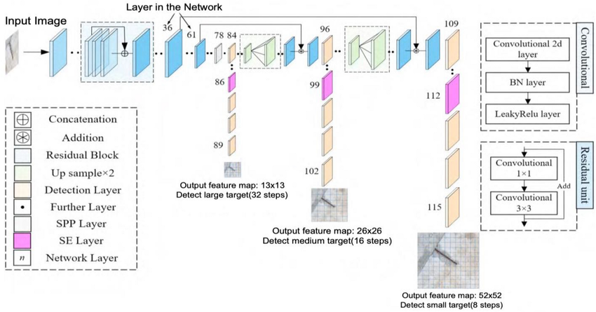
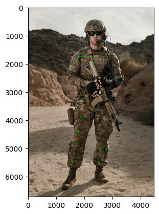
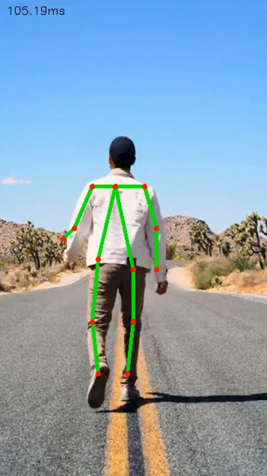

# QuantaPose-Detect

[](https://www.python.org/)
[](https://pjreddie.com/darknet/yolo/)
[](https://opensource.org/licenses/MIT)
[](https://jupyter.org/)
[](https://opencv.org/)



## Project Description

QuantaPose-Detect is an advanced deep learning project designed to perform both pose estimation and object detection using the YOLOv3 algorithm. The main objective of this project is to accurately identify objects in images and videos, and simultaneously estimate the poses of these objects, particularly human figures. By integrating the robust object detection capabilities of YOLOv3 with pose estimation, QuantaPose-Detect offers a comprehensive solution for various computer vision applications such as surveillance, sports analytics, human-computer interaction, and augmented reality.

## Table of Contents

- [Installation](#installation)
- [Usage](#usage)
  - [Image Inference](#image-inference)
  - [Webcam Inference](#webcam-inference)
  - [Video Inference](#video-inference)
- [Results](#results)
- [Why YOLOv3](#why-yolov3)
- [Future Scope](#future-scope)
- [References](#references)
- [License](#license)

## Installation

1. Clone the repository:
   ```sh
   git clone https://github.com/KoustavD1423/QuantaPose-Detect.git
   cd QuantaPose-Detect
   ```

2. Create a virtual environment and activate it:
   ```sh
   python -m venv venv
   source venv/bin/activate  # On Windows use `venv\Scripts\activate`
   ```

3. Install the required dependencies:
   ```sh
   pip install -r requirements.txt
   ```

4. Download the YOLOv3 weights and place them in the `input_weights` folder.

## Usage

### Image Inference

To perform pose estimation and object detection on an image, run the following command:

```sh
jupyter notebook PoseEstimation_Objectdetection_YOLOV3.ipynb
```

Open the notebook and follow the instructions to run the inference.

### Webcam Inference

To perform real-time inference using your webcam, run the following script:

```sh
python PoseEstimation_Objectdetection_YOLOV3_webcam.py
```

### Video Inference

To perform inference on a video file, run the following script:

```sh
python PoseEstimation_Objectdetection_YOLOV3_videoinfernec.py --input path/to/video.mp4
```

## Results

Here are some sample output images demonstrating the pose estimation and object detection capabilities of QuantaPose-Detect:

| Output 1 | Output 2 |
|----------|----------|
|  |  |

## Why YOLOv3

YOLOv3 (You Only Look Once, version 3) is one of the most powerful and efficient object detection algorithms available. The reasons for choosing YOLOv3 for this project are:

1. **Real-Time Performance**: YOLOv3 is known for its ability to perform object detection in real-time, making it suitable for applications requiring live video analysis and interactive systems.

2. **High Accuracy**: Despite its speed, YOLOv3 does not compromise on accuracy. It uses a deeper network and improved techniques to achieve high precision in detecting objects.

3. **Multiple Object Detection**: YOLOv3 is capable of detecting multiple objects within a single frame, making it highly effective for complex scenes where multiple objects and poses need to be identified simultaneously.

4. **Robustness**: YOLOv3 performs well under various conditions, including different lighting, scales, and occlusions, ensuring reliable detection in diverse environments.

### How YOLOv3 Works in This Project

In this project, YOLOv3 is used to detect objects and estimate poses by:

- **Bounding Box Prediction**: YOLOv3 predicts bounding boxes around objects and assigns class probabilities to these boxes.
- **Feature Extraction**: It uses a convolutional neural network (CNN) to extract features from the input image, identifying key points for pose estimation.
- **Pose Estimation Integration**: The detected objects are further analyzed to estimate their poses, providing detailed information about their orientation and position.

## Future Scope

The QuantaPose-Detect project has several potential future developments, including:

1. **Enhanced Pose Estimation**: Integrating more advanced pose estimation algorithms to improve the accuracy and robustness of pose predictions.
2. **Additional Object Classes**: Expanding the range of detectable objects by training the model on larger and more diverse datasets.
3. **Edge Computing**: Implementing the model on edge devices for real-time inference in resource-constrained environments.
4. **Augmented Reality**: Combining object detection and pose estimation with augmented reality applications for interactive and immersive experiences.
5. **Behavior Analysis**: Extending the project to include behavior analysis, such as action recognition and gesture detection, for more comprehensive scene understanding.

## References

QuantaPose-Detect builds on the powerful YOLOv3 architecture, known for its real-time object detection performance. Here are some key references that highlight the effectiveness of YOLOv3:

- Redmon, J., & Farhadi, A. (2018). [YOLOv3: An Incremental Improvement](https://pjreddie.com/media/files/papers/YOLOv3.pdf).
- Redmon, J., & Farhadi, A. (2017). [YOLO9000: Better, Faster, Stronger](https://pjreddie.com/media/files/papers/YOLO9000.pdf).
- Redmon, J., Divvala, S., Girshick, R., & Farhadi, A. (2016). [You Only Look Once: Unified, Real-Time Object Detection](https://pjreddie.com/media/files/papers/yolo.pdf).

## License

This project is licensed under the MIT License - see the [LICENSE](LICENSE) file for details.

## Contact

If you have any questions, suggestions, or feedback, feel free to contact me:

- Email: [ghostsneverdie123@gmail.com](mailto:ghostsneverdie123@gmail.com)
- LinkedIn: [https://www.linkedin.com/in/koustav-das-384b96223/](https://www.linkedin.com/in/koustav-das-384b96223/)
- GitHub: [https://github.com/KoustavD1423](https://github.com/KoustavD1423)
```
